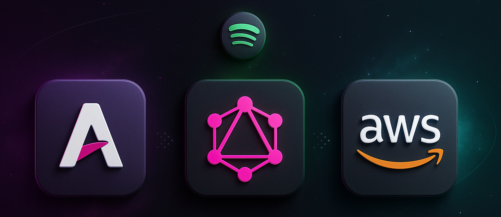
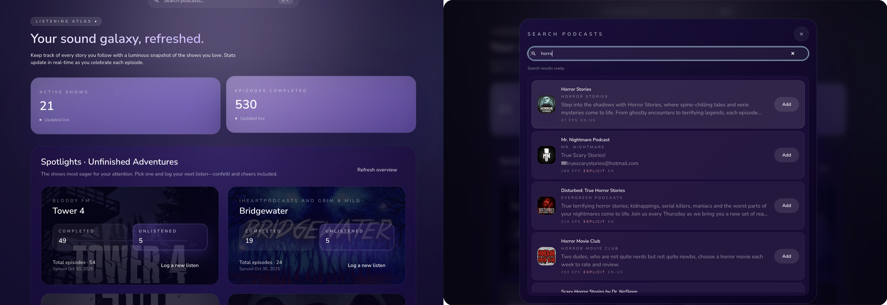
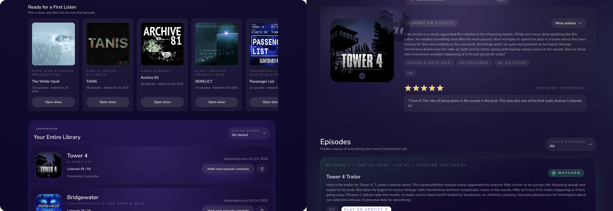

# Podcast Tracker

Podcast Tracker keeps tabs on every show you follow by syncing with the Spotify catalog so new releases surface automatically. A dedicated episode page highlights the latest drops and gives you quick context before you press play. Each show has its own page with rich details, letting you decide what deserves a spot in your queue. Your personal profile page remembers listening history and makes it easy to pick up where you left off while discovering fresh episodes.

## Technologies

- [Astro](https://astro.build/) and [TypeScript](https://www.typescriptlang.org/) drive the web app, with [Tailwind CSS](https://tailwindcss.com/) handling responsive styling.
- [GraphQL](https://graphql.org/) powers the API, with [Apollo Client](https://www.apollographql.com/docs/react/) and [GraphQL Code Generator](https://the-guild.dev/graphql/codegen) managing strongly typed queries.
- [AWS Lambda](https://aws.amazon.com/lambda/) and [DynamoDB](https://aws.amazon.com/dynamodb/) store and serve podcast data through lightweight serverless functions.
- [AWS CDK](https://aws.amazon.com/cdk/) defines repeatable cloud infrastructure for the web, API, and supporting services.
- [Vitest](https://vitest.dev/), [ESLint](https://eslint.org/), and [Prettier](https://prettier.io/) keep the codebase tested, linted, and consistently formatted.
- [Ink](https://github.com/vadimdemedes/ink) powers a keyboard-first terminal UI for the same podcast workflows as the web app.

## CLI (Terminal UI)

The repo now includes a first-class CLI app in `apps/cli` with GraphQL feature parity:

- Profile stats + library browsing
- Global podcast search with subscribe/unsubscribe
- Show detail + episode pagination
- Episode progress actions (single, next, all)
- Show rating/review and drop/unsubscribe actions
- OAuth login (Cognito Authorization Code + PKCE)

### Required environment variables

- `PODCAST_TRACKER_APPSYNC_URL`
- `PODCAST_TRACKER_COGNITO_DOMAIN`
- `PODCAST_TRACKER_COGNITO_CLIENT_ID`
- `PODCAST_TRACKER_COGNITO_REDIRECT_URI` (default `http://localhost:4321/auth/callback`)
- `PODCAST_TRACKER_COGNITO_LOGOUT_URI` (default `http://localhost:4321/`)

### Commands

```bash
npm run cli:dev
npm run cli:build
npm run cli:start
npm run cli:test
npm run cli:test:e2e
npm run cli:verify:e2e
```

### Run options

Option A: run without global install (recommended for local dev)

```bash
npm run cli:start -- auth login
npm run cli:start -- auth status
npm run cli:start
```

Option B: install the `podcast-tracker` command globally from this workspace

```bash
npm run cli:build
npm link --workspace apps/cli
podcast-tracker auth login
podcast-tracker
```

If `podcast-tracker` is still not found after linking, ensure your npm global bin is on PATH:

```bash
npm config get prefix
# add "<prefix>/bin" to PATH in ~/.zshrc, then restart shell
```

### Keybindings

- Global: `/` search, `?` help, `q` back/quit
- Lists: `j/k` move, `Enter` open/select
- Home: `s` sort, `f` filter, `n` mark next, `u` unsubscribe
- Show: `Enter` toggle episode progress, `n` mark next, `a` mark all, `s` subscribe toggle, `d` drop, `t` rate, `o` open URL, `]` load more episodes

### Live E2E Tests

The CLI now has live end-to-end tests in `apps/cli/src/__tests__/live.e2e.test.ts`.
They are non-destructive (read-only) and require:

- built CLI artifacts (`npm run cli:build`)
- local env file at `.env.local`
- an authenticated session file (`podcast-tracker auth login`)

Run:

```bash
npm run cli:test:e2e
```

Full gate (lint + unit/integration + build + live E2E):

```bash
npm run cli:verify:e2e
```

Below are a few interface captures from the latest build. They highlight the profile dashboard, podcast search flow, listening library, and show detail experience.



