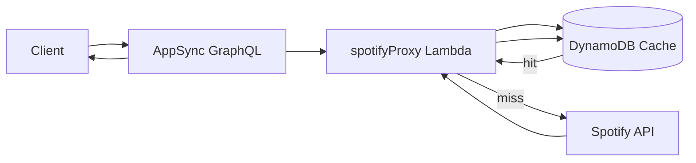
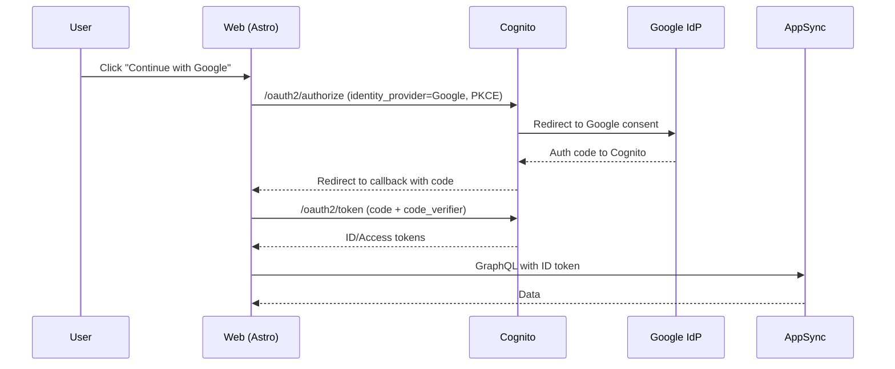

# Serverless Podcast Tracker — Technical Design

## 1. Architecture Overview

High-level serverless architecture optimized for near-zero cost and EU residency:

- Edge: CloudFront distribution serving static Astro build from a private S3 bucket via OAC. Custom domain `podcast.casperkristiansson.com` via Route 53 hosted zone `casperkristiansson.com`, with an ACM certificate in `us-east-1` attached to CloudFront. Optional CloudFront Function to inject security headers.
- Auth: Cognito User Pool with Google IdP; user pool domain and app client configured for OAuth 2.0 Authorization Code + PKCE. Self-registration disabled.
- API: AWS AppSync GraphQL with Cognito User Pools as the primary auth mode. Additional IAM auth for backend ingestion where required.
- Data: Single-table DynamoDB with on-demand capacity. TTL enabled for cache items.
- Integrations: Lambda (Node.js 20) using Spotify Client Credentials. Responses cached in DynamoDB `Cache` items with TTL. Handles rate limits (HTTP 429) with backoff.
- Jobs: EventBridge Scheduler nightly trigger → Lambda to upsert the latest episodes.
- Secrets: SSM Parameter Store (standard tier) with AWS-managed KMS for encryption at rest.
- Frontend: Astro + React + Tailwind (class-based dark mode) with Radix/shadcn components; custom login page performing PKCE and token exchange against Cognito endpoints; AppSync calls authorized with the Cognito ID token.

Regions

- Primary region: `eu-north-1` for Cognito, AppSync, DynamoDB, Lambda, EventBridge, SSM Parameter Store, and the S3 origin bucket.
- Certificate region: `us-east-1` for the CloudFront ACM certificate (required by CloudFront). CloudFront is global; Route 53 is global.

## 2. Boundaries and Responsibilities

Stacks (AWS CDK v2, TypeScript)

- EdgeStack (eu-north-1): S3 site bucket (private), CloudFront distribution, OAC, default index/error, optional headers function; consumes a certificate ARN provisioned in us-east-1; Route 53 A/AAAA alias records in hosted zone `casperkristiansson.com` pointing to the distribution.
- CertStack (us-east-1): DNS-validated ACM certificate for `podcast.casperkristiansson.com` using the Route 53 hosted zone. Exports the certificate ARN for use by EdgeStack.
- AuthStack: Cognito User Pool, Google IdP, user pool domain, app client (Auth Code + PKCE), callback/logout URLs; self-registration disabled.
- ApiDataStack: AppSync GraphQL API (Cognito primary auth, IAM additional), DynamoDB single-table with TTL for cache, data sources (DDB direct resolvers and Lambda for Spotify), GraphQL schema.
- JobsStack: EventBridge Scheduler rule targeting the nightly refresh Lambda.
- ConfigStack: SSM parameters for Spotify client ID/secret and shared configuration (single production environment).

Deployment Conventions

- Local developer deployments use AWS CLI/SDK profile `Personal` for `cdk bootstrap` and `cdk deploy`.
- Bootstrap accounts in both `eu-north-1` (application stacks) and `us-east-1` (certificate stack).
- Operate a single production environment. CI/CD remains GitHub Actions with OIDC to AWS; workflows deploy infrastructure and web assets directly to production in `eu-north-1` (certificate provisioning in `us-east-1`).

Services / Packages

- packages/lambdas/spotifyProxy: Handles `search`, `getShow`, `getEpisodes`. Obtains and caches Spotify token (client credentials) and response payloads. Respects rate limits with retry-after.
- packages/lambdas/refreshSubscribedShows: On schedule, iterates subscriptions and upserts new episodes fetched from Spotify.
- apps/api: GraphQL schema and docs. (Resolvers are configured in CDK; VTL mapping templates for DDB, Lambda for Spotify.)
- apps/web: Astro + React frontend, Tailwind dark-mode class strategy, Radix/shadcn components, PKCE login flow, and GraphQL client integration (queries, mutations, subscriptions).

Cross-Boundary Contracts

- AppSync → Lambda (spotifyProxy): event payload carries GraphQL field name and arguments; response matches GraphQL types.
- EventBridge → refresh Lambda: scheduled event with environment context; Lambda discovers subscriptions from DynamoDB.
- Frontend → Cognito: OAuth 2.0 endpoints `/oauth2/authorize` and `/oauth2/token` with PKCE.
- Frontend → AppSync: GraphQL over HTTPS and WebSocket for subscriptions; signed with Cognito ID token.

## 3. Data Models and Contracts

Single-table DynamoDB using `pk` (partition key) and `sk` (sort key):

- User: `pk=user#<sub>`, `sk=meta`
- Subscription: `pk=user#<sub>`, `sk=sub#<showId>`
- Progress: `pk=user#<sub>`, `sk=ep#<episodeId>`, `completed: boolean`
- Show: `pk=show#<spotifyShowId>`, `sk=meta`, `title`, `publisher`, `image`, `feedUrl?`, `lastSeen: ISO or epoch`
- Episode: `pk=show#<spotifyShowId>`, `sk=ep#<episodeId>`, `title`, `audioUrl`, `publishedAt`, `durationSec`
- Cache: `pk=cache#<key>`, `sk=spotify`, `payload: string/json`, `expiresAt: number` (epoch seconds; TTL enabled on this attribute)

Optional GSI (gsi1) for operations scanning by type at low cost (optional for MVP):

- PK: `sk`, SK: `pk` → enables querying all `Subscription` items by prefix `sub#` for the nightly job without a table scan. If omitted, nightly job can perform a small table scan in MVP given low scale.

GraphQL Types (representative)

- scalar: `AWSDateTime`
- `type Show { id: ID!, title: String!, publisher: String!, image: String, feedUrl: String, lastSeen: AWSDateTime }`
- `type Episode { id: ID!, showId: ID!, title: String!, audioUrl: String!, publishedAt: AWSDateTime!, durationSec: Int! }`
- `type Subscription { showId: ID!, createdAt: AWSDateTime }`
- `type Progress { episodeId: ID!, userId: ID!, completed: Boolean! }`

ID Mapping

- Show.id ↔ `spotifyShowId`
- Episode.id ↔ `episodeId` (globally unique within a show context)
- Subscription.showId ↔ `spotifyShowId`
- Progress.userId ↔ Cognito `sub`

## 4. APIs and Endpoints

GraphQL (AppSync)

- Auth: Cognito User Pools (ID token in `Authorization` header). Subscriptions use the same token in the WebSocket connection payload.
- Queries
  - `search(term: String!): [Show!]!` → Lambda `spotifyProxy` + DDB Cache
  - `subscriptions: [Subscription!]!` → DDB direct resolver querying `pk=user#<sub>` and `begins_with(sk, 'sub#')`
  - `episodes(showId: ID!, cursor: String, limit: Int = 50): [Episode!]!` → DDB direct resolver on `pk=show#<showId>`; `cursor` maps to `ExclusiveStartKey` when provided; `limit` maps to `Limit`
- Mutations
  - `subscribe(showId: ID!): Subscription!` → DDB put (idempotent upsert) of `pk=user#<sub>`, `sk=sub#<showId>`; returns `Subscription`
  - `markProgress(episodeId: ID!, completed: Boolean): Progress!` → DDB put/update of `pk=user#<sub>`, `sk=ep#<episodeId>`; then publish `progressUpdated`
- Subscriptions
  - `progressUpdated(userId: ID!): Progress!` → AppSync subscription filtered so only matching `userId` subscribers receive events

Lambda `spotifyProxy` (Node.js 20)

- Input (from AppSync Lambda resolver): `{ fieldName: 'search' | 'getShow' | 'getEpisodes', arguments: {...}, identity: {...} }`
- Output: GraphQL-typed objects matching `Show` or `Episode` arrays.
- Errors: throws GraphQL errors with `extensions.code` (see taxonomy below).

OAuth Endpoints (Cognito)

- `GET https://<cognito-domain>/oauth2/authorize` with `client_id`, `response_type=code`, `redirect_uri`, `code_challenge`, `code_challenge_method=S256`, `identity_provider=Google`, `scope=openid profile email`
- `POST https://<cognito-domain>/oauth2/token` with `grant_type=authorization_code`, `client_id`, `redirect_uri`, `code`, `code_verifier`

Error Taxonomy (GraphQL `extensions.code`)

- `AUTH_NOT_AUTHORIZED`: missing/invalid token, or insufficient privileges.
- `VALIDATION_ERROR`: input validation failure.
- `NOT_FOUND`: entity does not exist.
- `RATE_LIMITED`: upstream Spotify 429; include retry-after.
- `UPSTREAM_UNAVAILABLE`: Spotify or other upstream 5xx.
- `INTERNAL_ERROR`: unexpected server errors.

## 5. State Management and Side Effects

Frontend

- Tokens (ID/access) stored in `sessionStorage` by default; refreshed via standard Cognito expiration. Optionally keep a short-lived in-memory cache to reduce storage reads.
- Dark-mode persisted in `localStorage` and applied via Tailwind `class` strategy on `<html>`.
- GraphQL client minimal footprint (e.g., `graphql-request` + `graphql-ws`) to call AppSync and handle subscriptions.

Backend

- Progress writes are idempotent upserts keyed by `user#<sub>` + `ep#<episodeId>`.
- Subscribe is idempotent upsert keyed by `user#<sub>` + `sub#<showId>`.
- Cache writes store `payload` and `expiresAt` (epoch seconds) with TTL enabled.

Side Effects

- `markProgress` publishes a real-time event to `progressUpdated` for the user.
- Nightly job upserts `Episode` and may update `Show.lastSeen`.

## 6. Failure Modes, Retries, Timeouts, Idempotency

Lambdas

- Timeout: 5–10s for spotifyProxy; 60–300s for refresh job depending on expected volume.
- Retries: spotifyProxy uses exponential backoff with jitter for Spotify 429/5xx (respect `Retry-After`); refresh job uses AWS retry policies on failure or dead-letter queue (optional) for resilient processing.
- Idempotency: subscribe/progress/episode upserts are idempotent by key; conditional writes guard against duplication if needed.

AppSync

- DDB resolvers: leverage `Limit`, `ExclusiveStartKey` for pagination; return consistent errors on missing items or insufficient auth.
- Subscriptions: connection-level failures result in client reconnect with backoff.

Frontend

- PKCE failures (bad verifier) redirect user to login with a fresh code challenge.
- Network failures show retry UI; persistent auth errors trigger logout and re-auth.

## 7. Security and Privacy Controls

AuthN/AuthZ

- Cognito User Pool + Google IdP; user pool domain; PKCE enforced. Self-registration disabled.
- AppSync primary auth: Cognito. Additional IAM auth only for backend ingestion where required.

Data Handling

- Minimal PII: store Cognito `sub` only; avoid storing emails or names unless necessary.
- DynamoDB, S3, and AppSync encrypted at rest (AWS-managed keys). Parameter Store standard tier with AWS-managed KMS.
- Cache entries store third-party data; TTL automatically removes stale items.

Secrets

- Spotify client ID/secret in SSM Parameter Store; accessed by Lambdas with least-privilege IAM.

Edge and Transport

- S3 bucket (eu-north-1) is private; CloudFront OAC enforces origin policy. TLS 1.2+ on CloudFront. Custom domain `podcast.casperkristiansson.com` served with ACM certificate in `us-east-1`. Security headers via CloudFront Function (optional).

Client

- Tokens kept in `sessionStorage`; avoid persistent localStorage for tokens. CSRF not applicable for GraphQL bearer flow; XSS protections via strict CSP headers (optional) and framework defaults.

## 8. Performance Targets and Budgets

Latency (P95)

- AppSync simple DDB queries (subscriptions): ≤ 250 ms
- Search via cache: ≤ 300 ms; cache miss hitting Spotify: ≤ 1.5 s
- Nightly refresh job: completes in ≤ 10 minutes for ≤ 10k subscriptions

Throughput & Capacity

- DynamoDB on-demand; expect low baseline RCU/WCU. Subscriptions and progress writes scale linearly by user actions.
- Lambda memory 256–512 MB for spotifyProxy; 512–1024 MB for refresh job depending on batch processing.

Cost

- Static hosting + on-demand services to remain in free/near-free tiers at MVP scale. Aggressive caching to minimize Spotify calls and Lambda executions.

## 9. Observability

Logging

- Structured JSON logs from Lambdas (request IDs, function name, latency, cache hit/miss, Spotify status code, retry count).

Metrics

- Custom metrics: `CacheHitRate`, `Spotify429Count`, `SpotifyLatencyMs`, `EpisodesUpserted`, `SubscriptionsCount`.
- Native metrics: Lambda errors/duration, DynamoDB throttles/consumed capacity, AppSync error rates.

Traces

- Enable X-Ray for Lambdas and AppSync for distributed tracing (optional in MVP).

Dashboards & Alerts

- CloudWatch dashboard summarizing custom + native metrics.
- Alarms: Lambda error rate > 1% 5m, DynamoDB throttles > threshold, AppSync 5xx rate > threshold, Spotify 429s sustained.

## 10. Trade-offs and Alternatives

- Direct DDB resolvers vs Lambda: Direct resolvers minimize latency and cost for CRUD; Lambda reserved for Spotify integration where logic and rate limiting are needed.
- Single-table vs multi-table: Single-table reduces cost and simplifies cross-entity access; multi-table could isolate concerns but adds cost/complexity.
- `graphql-request` vs Apollo/urql: `graphql-request` is smaller and sufficient for MVP; Apollo/urql add features but increase bundle size.
- SessionStorage for tokens: Minimizes persistence risk; localStorage eases persistence but higher exposure if XSS.
- Optional GSI for nightly job: Avoids table scans at scale; can defer until scale warrants.
- Secrets in Parameter Store: Cheaper than Secrets Manager for standard tier; Secrets Manager adds rotation and lifecycle features.

## 11. Diagrams (Mermaid)

Flowchart — Search and Cache



Sequence — Auth with Google + PKCE



ER — DynamoDB Single Table (logical)

```mermaid
erDiagram
  USER ||--o{ SUBSCRIPTION : has
  USER ||--o{ PROGRESS : has
  SHOW ||--o{ EPISODE : has
  USER {
    string pk
    string sk
  }
  SUBSCRIPTION {
    string pk
    string sk
  }
  PROGRESS {
    string pk
    string sk
    bool completed
  }
  SHOW {
    string pk
    string sk
    string title
    string publisher
    string image
    string feedUrl
    datetime lastSeen
  }
  EPISODE {
    string pk
    string sk
    string title
    string audioUrl
    datetime publishedAt
    int durationSec
  }
  CACHE {
    string pk
    string sk
    json payload
    int expiresAt
  }
```

## 12. Traceability to Acceptance Criteria

- AC-serverless-podcast-tracker-01 (Google-only sign-in) → Sections 2 (AuthStack), 4 (OAuth Endpoints)
- AC-02 (Self-registration disabled) → Section 2 (AuthStack)
- AC-03 (Token exchange completes) → Section 4 (OAuth Endpoints), 5 (Frontend state)
- AC-04 (AppSync authorized via Cognito) → Sections 2 (ApiDataStack), 4 (GraphQL Auth)
- AC-05 (Unauthorized rejected) → Sections 4 (Error taxonomy), 7 (AuthZ)
- AC-06 (Search via Lambda + cache) → Sections 2 (spotifyProxy), 4 (Queries), 11 (Flowchart)
- AC-07 (Subscriptions list from DDB) → Sections 3 (Data model), 4 (subscriptions query)
- AC-08 (Episodes pagination) → Sections 4 (episodes query: cursor → ExclusiveStartKey); cursor derived from last item’s key
- AC-09 (Subscribe upsert) → Sections 3 (Subscription item), 5 (Idempotent upsert)
- AC-10 (Progress update) → Sections 3 (Progress item), 5 (Idempotent upsert)
- AC-11 (Real-time progress) → Sections 4 (Subscription), 5 (Side effect publish)
- AC-12 (Spotify Client Credentials) → Sections 2 (spotifyProxy), 7 (Secrets)
- AC-13 (Rate limiting handled) → Section 6 (Retries/backoff)
- AC-14 (Nightly refresh) → Sections 2 (JobsStack), 4 (refresh job), 5 (Side effects)
- AC-15 (S3+CloudFront OAC) → Sections 1/2 (Edge), 7 (Edge/Transport)
- AC-16 (Cache TTL) → Sections 3 (Cache TTL), 6 (Idempotency, expiry)
- AC-17 (CI checks) → Requirements reference; design assumes CI enforces TS strict, lint, tests
- AC-18 (Infra deploy on main) → Requirements reference; design aligns with CDK stacks
- AC-19 (Web deploy invalidation) → Requirements reference; design aligns with Edge stack usage
- AC-20 (Google-only enforced) → Sections 2 (AuthStack), 4 (OAuth), 7 (AuthN/AuthZ)
- AC-21 (Custom domain served over HTTPS) → Sections 1 (Edge domain/cert), 2 (EdgeStack), 7 (Edge and Transport)
- AC-22 (Local AWS profile Personal) → Sections 2 (Deployment Conventions)
- AC-23 (Region strategy enforced) → Sections 1 (Regions), 2 (Stacks + CertStack), Deployment Conventions

Note on AC-08: The API surface remains `episodes(...): [Episode!]!`. The next page cursor is derived from the last returned item’s key; clients pass it back via `cursor` for subsequent pages (no extra field required).

## 13. Context Digest

- docs/specs/serverless-podcast-tracker/requirements.md — Approved requirements spec used as the primary source.
- docs/specs/serverless-podcast-tracker/ — Target location for design, matching repo’s docs/specs pattern.
- No additional code/config files present in repo; design reflects serverless patterns outlined in requirements.
